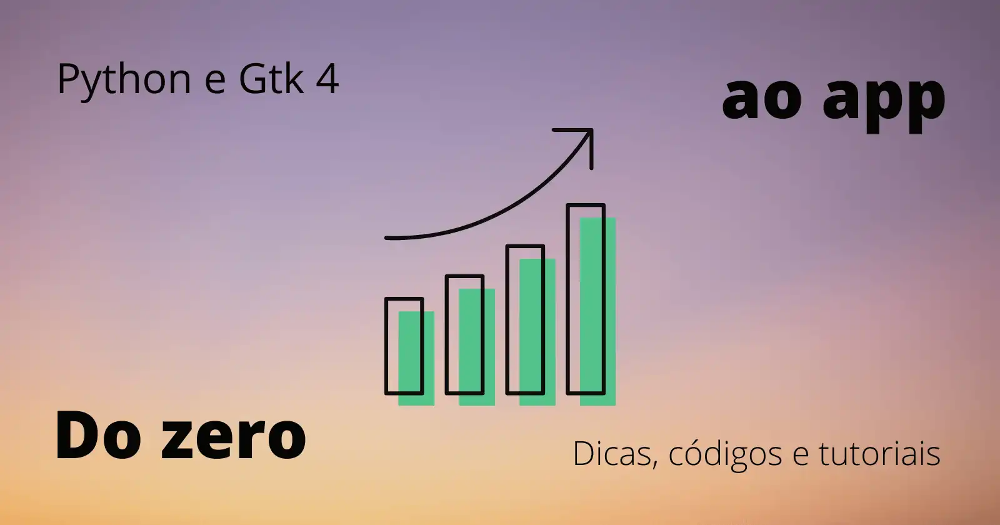

# Criando interfaces gráficas com Python (PyGObject) e Gtk

[](https://github.com/natorsc/gui-python-gtk "Ir para o repositório.")
&nbsp;
[](https://github.com/natorsc/gui-python-gtk)
&nbsp;
[](https://github.com/natorsc/gui-python-gtk)

[](https://stopthemingmy.app)

[](https://github.com/natorsc/gui-python-gtk)

## Descrição

Repositório criado para documentar e centralizar conteúdos, dicas, tutoriais e exemplos de código sobre a construção de interfaces com a linguagem de programação Python e o toolkit gráfico Gtk.

---

## Status do projeto

🚧 Em construção 🚀

---

## 🛠 Tecnologias utilizadas

Até o presente momento as seguintes tecnologias estão sendo utilizadas na construção do projeto:

[](https://www.python.org/ "Ir para o site.")
&nbsp;
[](https://pypi.org/project/PyGObject/ "Ir para o PyPi.")
&nbsp;
[](https://www.gtk.org/ "Ir para o site.")
&nbsp;
[](https://www.gnome.org/ "Ir para o site.")
&nbsp;
[](https://flatpak.org/ "Ir para o site.")

---

## Autor

Feito com 💙 por [Renato Cruz](https://github.com/natorsc) 🤜🤛 Entre em contato!

[](https://www.linkedin.com/in/natorsc/ "Ir para o Linkedin.")
&nbsp;
[](mailto:natorsc@gmail.com "Enviar e-mail.")
&nbsp;
[](https://matrix.to/#/@natorsc:matrix.org "Entre em contato.")

Uma das playlist que costumo ouvir quando estou estudando ou codando:

[](https://open.spotify.com/playlist/1xf3u29puXlnrWO7MsaHL5?si=A-LgwRJXSvOno_e6trpi5w&utm_source=copy-link "Acessar playlist.")

Sempre que possível escrevo tutoriais no meu blog pessoal:

[](https://blog.codigoninja.dev/ "Ir para o blog.")

## Doações

### Ko-Fi

[](https://ko-fi.com/natorsc "Faça uma doação.")

### Pix


**Chave**: `b1839493-2afe-484d-9272-82a3e402b36f`

---

## Tabela de conteúdos

- [Pré-requisitos](#pre-requisitos).
- [Links úteis](#links-uteis).
- [Sobre o Gtk](#sobre-o-gtk).
- [Gtk 4](#gtk-4).
  - [Widgets](#gtk-4-widgets)
- [Gtk 4 libadwaita](#gtk-4-libadwaita).
  - [Widgets](#libadwaita-widgets).
- [Descontinuado](#descontinuado-deprecated).

---

## Pre-requisitos

### Tutoriais

#### Microsot Windows

- [Python e Gtk 4: Criando o ambiente de desenvolvimento no Windows](https://blog.codigoninja.dev/python-e-gtk-4-criando-o-ambiente-de-desenvolvimento-no-windows).

#### Distribuições Linux

- [Python e Gtk 4: Criando o ambiente de desenvolvimento no Linux](https://blog.codigoninja.dev/python-e-gtk-4-criando-o-ambiente-de-desenvolvimento-no-linux).

---

## Links uteis

### Documentação

- [Documentação Gtk 3](https://docs.gtk.org/gtk3/).
- [Documentação Gtk 4](https://docs.gtk.org/gtk4/).
- [Documentação libadwaita](https://gnome.pages.gitlab.gnome.org/libadwaita/doc/).
- [Guia para desenvolvedores](https://developer.gnome.org/).

### Softwares

#### Depuração

- [Gtk Inspector](https://blog.codigoninja.dev/como-ativar-a-ferramenta-de-depuracao-interativa-gtk-inspector)

#### RAD

- [Gnome Glade](https://glade.gnome.org/) (Não é mais recomendado).
- [Cambalache](https://flathub.org/apps/details/ar.xjuan.Cambalache).

#### IDEs

- [Gnome Builder](https://wiki.gnome.org/Apps/Builder).

#### Icons

- [IconLibrary](https://flathub.org/apps/details/org.gnome.design.IconLibrary).
- [Icon Browser](https://blog.codigoninja.dev/como-instalar-o-aplicativo-gtk-4-icon-browser).

---

## Sobre o Gtk

O GTK é um toolkit multiplataforma para a criação de interfaces gráficas.

O mesmo utiliza licença GNU LGPL, o que permite a sua utilização para construção de softwares que sejam livres ou proprietários.

Foi desenvolvido inicialmente para o GIMP (GNU Image Manipulation Program), por isso foi batizado de GIMP Toolkit ou simplesmente GTK.

Originalmente criado por, Peter Mattis, Spencer Kimball e Josh MacDonald.

O GTK é comumente utilizado na elaboração de aplicativos para o ambiente de desktop GNOME, contudo por ser multiplataforma pode ser executado sem problemas em diversos sistemas operacionais e ambientes gráficos.

O toolkit é escrito em C e o seu design é orientado a objeto com base no sistema de objetos da biblioteca GLib.

Existe o suporte a diversas linguagens de programação (bindings), contudo as linguagem que são **suportadas oficialmente** (até o momento que escrevo) são:

- [C++](https://www.cplusplus.com/).
- [C#](https://docs.microsoft.com/pt-br/dotnet/csharp/).
- [C](https://pt.wikipedia.org/wiki/C_(linguagem_de_programa%C3%A7%C3%A3o)).
- [JavaScript](https://www.javascript.com/).
- [Python](https://www.python.org/).
- [Rust](https://www.rust-lang.org/pt-BR).
- [Vala](https://wiki.gnome.org/Projects/Vala).

Sempre que possível de preferencia por iniciar um projeto utilizando o Gnome Builder.

> 🚨 O Gnome Builder não está disponível para Microsoft Windows.

---

## Gtk 4

O GTK 4 foi lançado em 16 de dezembro 2020.

No GTK 4 é desencorajado o uso do Gnome Glade, isso porque o Gnome Builder fornece uma forma padronizada e moderna de se criar e gerenciar os projetos.

### Arquitetura


### bibliotecas:

#### [GLib](https://docs.gtk.org/glib/)

GLib é uma biblioteca central de baixo nível que forma a base do GTK. Ele fornece manipulação de estrutura de dados para C, wrappers de portabilidade e interfaces para funcionalidade de tempo de execução como um loop de eventos, threads, carregamento dinâmico e um sistema de objetos.

#### [Pango](https://docs.gtk.org/Pango/)

Pango é uma biblioteca para layout e renderização de texto com ênfase na internacionalização. Ele forma o núcleo do manuseio de texto e fonte para GTK.

#### [Cairo](https://www.cairographics.org/)

Cairo é uma biblioteca para gráficos 2D com suporte para vários dispositivos de saída (incluindo o X Window System, Win32) ao mesmo tempo em que produz uma saída consistente em todas as mídias, aproveitando a aceleração do hardware de exibição quando disponível.

#### [GdkPixbuf](https://docs.gtk.org/gdk-pixbuf)

GdkPixbuf é uma biblioteca para carregar ativos gráficos como ícones em vários formatos, como PNG, JPEG e GIF.

#### [ATK](https://docs.gtk.org/atk/)

ATK é uma biblioteca para um conjunto de interfaces que fornecem acessibilidade. Ao suportar as interfaces ATK, um aplicativo ou kit de ferramentas pode ser usado com ferramentas como leitores de tela, ampliadores e dispositivos de entrada alternativos.


### Gtk 4 Widgets


> 🚜 Em construção 🚧.

- [Gtk.ActionBar](./docs/gtk4-widgets.md#gtk-actionbar).
- [Gtk.ApplicationWindow](./docs/gtk4-widgets.md#gtk-applicationwindow).
- [Gtk.Box (horizontal)](./docs/gtk4-widgets.md#gtk-box-horizontal).
- [Gtk.Box (vertical)](./docs/gtk4-widgets.md#gtk-box-vertical).
- [Gtk.Button](./docs/gtk4-widgets.md#gtk-button).
- [Gtk.Calendar](./docs/gtk4-widgets.md#gtk-calendar).
- [Gtk.CheckButton](./docs/gtk4-widgets.md#gtk-checkbutton).
- [Gtk.ComboBoxText](./docs/gtk4-widgets.md#gtk-comboboxtext).
- [Gtk.Dialog](./docs/gtk4-widgets.md#gtk-dialog).
- [Gtk.DragAndDrop (Gtk.DragSource e Gtk.DropTarget)](./docs/gtk4-widgets.md#gtk-drag-and-drop).
- [Gtk.Entry](./docs/gtk4-widgets.md#gtk-entry).
- [Gtk.EntryCompletion](./docs/gtk4-widgets.md#gtk-entrycompletion).
- [Gtk.FileChooserDialog (folder)](./docs/gtk4-widgets.md#gtk-filechooserdialog-folder).
- [Gtk.FileChooserDialog (open)](./docs/gtk4-widgets.md#gtk-filechooserdialog-open).
- [Gtk.FileChooserDialog (save)](./docs/gtk4-widgets.md#gtk-filechooserdialog-save).
- [Gtk.Fixed](./docs/gtk4-widgets.md#gtk-fixed).
- [Gtk.FlowBox](./docs/gtk4-widgets.md#gtk-flowbox).
- [Gtk.Grid](./docs/gtk4-widgets.md#gtk-grid).
- [Gtk.Image](./docs/gtk4-widgets.md#gtk-image).
- [Gtk.ListBox](./docs/gtk4-widgets.md#gtk-listbox).
- [Gtk.MenuButton](./docs/gtk4-widgets.md#gtk-menubutton).
- [Gtk.Overlay](./docs/gtk4-widgets.md#gtk-overlay).
- [Gtk.Picture](./docs/gtk4-widgets.md#gtk-picture).
- [Translator (gettext)](./docs/gtk4-widgets.md#translator-gettext).
- [Gtk.TreeView editable.](./docs/gtk4-widgets.md#treeview-editable).
- [Gtk.TreeView filter.](./docs/gtk4-widgets.md#treeview-filter).
- [Gtk.TreeView sort.](./docs/gtk4-widgets.md#treeview-sort).
- [Gtk.Video](./docs/gtk4-widgets.md#gtk-video).

---

## GTK 4 Libadwaita


> 🚜 Em construção 🚧.

A libadwaita deve estar disponível a partir do Gnome 41 ou 42, a mesma vem para substituir a biblioteca [libhandy](https://gitlab.gnome.org/GNOME/libhandy).

### Instalação

#### Arch Linux

```bash
sudo pacman -S libadwaita
```

> 📝 Se o `sudo` não funcionar faça login como **root** e faça a instalação se o ``sudo``.

#### Fedora

> 🚨 Fedora 35 ou superior.

```bash
sudo dnf install libadwaita-devel
```

#### openSUSE Tumbleweed

```bash
sudo zypper install libadwaita-devel
```

### Libadwaita widgets

- [Adw.ActionRow](./docs/gtk4-widgets-libadwaita.md#adw-actionrow).
- [Adw.animation].
- [Adw.ApplicationWindow].
- [Adw.Avatar](./docs/gtk4-widgets-libadwaita.md#adw-avatar).
- [Adw.Bin].
- [Adw.Carousel](./docs/gtk4-widgets-libadwaita.md#adw-carousel).
- [Adw.CarouselIndicatorDots](./docs/gtk4-widgets-libadwaita.md#adw-carouselindicatordots).
- [Adw.CarouselIndicatorLines](./docs/gtk4-widgets-libadwaita.md#adw-carouselindicatorlines).
- [Adw.ClampLayout].
- [Adw.ClampScrollable].
- [Adw.Clamp].
- [Adw.ComboRow].
- [Adw.DeprecationMacros].
- [Adw.EnumListModel].
- [Adw.EnumValueObject].
- [Adw.Enums].
- [Adw.ExpanderRow].
- [Adw.Flap](./docs/gtk4-widgets-libadwaita.md#adw-flap).
- [Adw.HeaderBar].
- [Adw.Leaflet].
- [Adw.Main].
- [Adw.NavigationDirection].
- [Adw.PreferencesGroup].
- [Adw.PreferencesPage].
- [Adw.PreferencesRow].
- [Adw.PreferencesWindow].
- [Adw.Squeezer].
- [Adw.StatusPage].
- [Adw.SwipeGroup].
- [Adw.SwipeTracker].
- [Adw.Swipeable].
- [Adw.Types].
- [Adw.ValueObject].
- [Adw.Version].
- [Adw.ViewSwitcherBar].
- [Adw.ViewSwitcherTitle].
- [Adw.ViewSwitcher].
- [Adw.WindowTitle].
- [Adw.Window].

---

## Descontinuado (deprecated)

Exemplos de código e bibliotecas que não estão recebendo mais atualização neste repositório.

### [GTK 3](./docs/gtk3-index.md)

### [GTK 3 Libhandy](./docs/gtk3-libhandy-index.md)

---
